# 异常控制流 (Exception Control Flow)
## 异常
**异常 exception**就是控制流中的突变, 用来响应处理器状态中的某些变化。

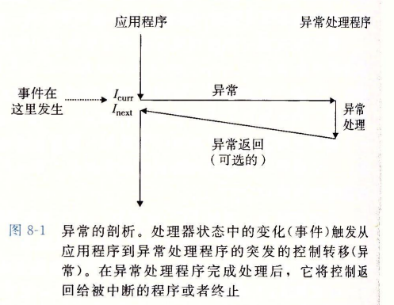

当处理检测到事件发生时, 通过异常表进行间接过程调用, 到一个异常处理程序。当异常处理程序完成后, 会发生以下三种情况中的一种:

1. 处理器将控制返回给当前正在执行的指令。
2. 处理器将控制返回给执行指令的下一条指令。
3. 处理程序终止被中断的程序。


### 异常处理
异常的处理需要硬件软件的紧密合作。

系统中每种类型的异常都分配了一个唯一的非负整数的异常号, 一些由处理器设计者分配, 另外由操作系统内核分配。

前者示例包括:

- 被零除
- 缺页
- 内存访问违例
- 断点
- 算术运算溢出

后者包括系统调用和来自I/O设备的信号。

在系统启动时, 操作系统分配和初始化一张异常表。

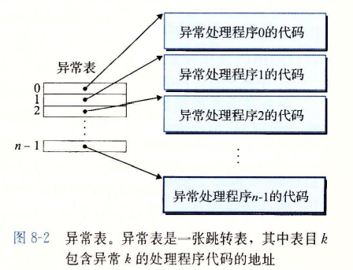

异常表的起始地址放在寄存器:异常表基址寄存器

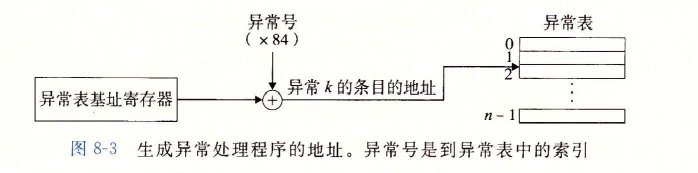

异常与普通过程调用的一些不同之处:

- 返回状态的多样性。
- 中断程序处理器会把一些额外的处理器状态压入栈中。
- 控制从用户转移到内核, 所有项目都被压到内核栈中而不是用户栈。
- 异常处理程序运行在内核模式下。


### 异常的类别

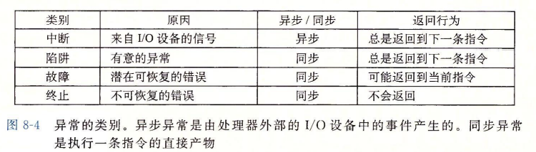

#### **中断**
中断是异步发生的, 是来自处理器外部的I/O设备的信号的结果, 例如网络适配器、磁盘控制器、定时器芯片。它们通过向处理器芯片上的一个引脚发信号, 并将异常号放到系统总线上, 来触发中断。

#### **陷阱和系统调用**
陷阱是有意的异常, 是执行一条指令的结果。陷阱最重要的用途是在用户程序和内核之间提供一个像过程调用一样的接口, 叫做系统调用。

用户程序经常需要向内核请求服务, 比如读一个文件(read)、创建一个新的进程(fork)、加载一个新的程序(execve)、终止当前的进程(exit)。为了这些受控访问, 处理器提供 syscall n指令。执行syscall会导致一个到异常处理程序的陷阱, 它解析传入参数, 并调用适当内核程序。

#### **故障**

一个经典的故障就是缺页异常。

#### **终止**
终止是不可恢复的致命错误造成的结果, 通常是一些硬件错误, 比如DRAM或者SRAM位被损坏时发生的奇偶错误。

### Linux/x86-64系统中的异常

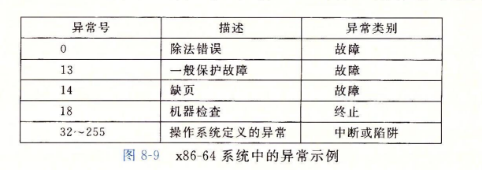

一般保护故障通常是因为一个程序引用了一个未定义的虚拟内存区域, 或者因为程序试图读写一个只读文本段, Linux不会尝试恢复这类故障, 一般将其报告为 Segmentation fault

机器检查是在导致故障的指令执行中检测到致命的硬件错误时发生的。

所有Linux系统调用的参数都是通过通用寄存器而不是栈传递的。


## 进程
进程的经典定义就是一个执行中程序的实例。系统中的每个程序都运行在某个进程的**上下文 context**中。上下文是由程序正确运行所需的状态组成, 包括存放在内存中的程序的代码和数据, 它的栈、通用目的寄存器的内容、程序计数器、环境变量以及打开文件描述符的集合。

进程提供给应用程序的关键抽象:

- 一个独立的逻辑控制流, 提供一个假象, 好像程序独占地使用处理器
- 一个私有的地址空间, 提供一个假象, 好像程序独占地使用内存系统

### 逻辑控制流

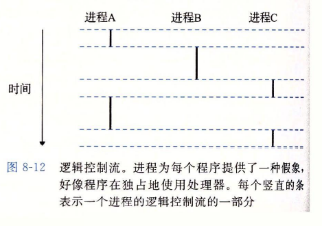

PC的值唯一对应的那个程序或链接的共享库的指令, 这些PC值的序列叫做**逻辑控制流**。

### 并发流

一个逻辑流的执行在时间段上与另一个流重叠, 称为并发流, 多个流并发地执行的一般现象称为并发。一个进程和其他进程轮流运行的概念称为多任务。一个程序执行它的控制流的一部分的每一时间段称为时间片, 因此多任务也叫做时间分片。

### 私有地址空间
进程也为每个程序提供一种抽象, 好像它独占地使用系统地址空间。进程为每个程序提供它的私有地址空间, 和这个空间相关联的内存是不能被其他进程读写的。

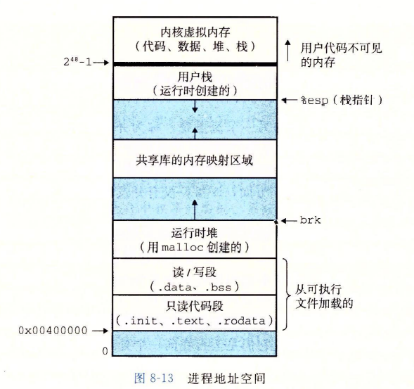


### 用户模式和内核模式
处理器必须提供一种机制, 限制一个应用程序可以执行的指令以及它可以访问的地址空间范围。

处理器通常用某个控制寄存器中的某一位来标识进程是运行在内核模式还是用户模式。一个运行在内核模式中的进程可以执行任何指令, 访问任何内存区域。

一个运行在用户模式的进程不允许执行特权指令, 也不允许直接引用地址空间中内核区内的代码和数据, 必须通过系统调用接口间接的访问。进程从用户模式变为内核模式的唯一方法是通过中断、故障或者陷入系统调用这样的异常, 当返回应用程序代码时, 处理器将内核模式变为用户模式。

Linux提供/proc文件系统使得一个用户程序可以访问内核数据结构的内容。

### 上下文切换
内核为每个进程维护一个上下文。上下文就是内核重新启动一个被抢占的进程所需的状态, 由一些对象值比如通用目的寄存器、浮点寄存器、程序计数器、用户栈、状态寄存器、内核栈和各种内核数据结构, 比如页表, 包含当前进程信息的进程表, 进程已打开的文件表。

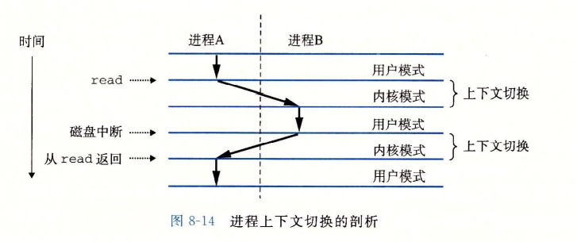

内核中由调度器对决策抢占进程进行调度。


## 系统调用错误处理
当Unix系统调用遇到错误, 通常会返回-1, 并设置全局整数变量errno。但许多人都会忽略错误检查因为它使代码臃肿切可读性降低。

减轻冗余:
```c

void unix_err(char *msg)
{
    fprintf(stderr, "%s: %s\n", msg, strerror(errno));
    exit(0);
}

pid_t Fork()
{
    pid_t pid;
    if(pid = fork() < 0)
        unix_err("fork error\n");
    
    return pid;
}
```

## 进程控制

详见UNIX高级环境编程


## 信号

### **进程组**
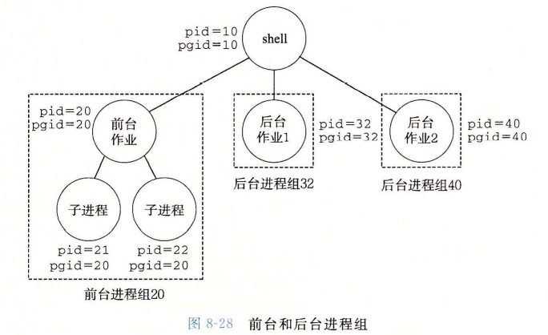

在键盘上输入Ctrl+C会导致内核发送一个SIGINT信号到前台进程组中的每个进程。默认情况下是终止前台作业。类似地, 输入Ctrl+Z会发送一个SIGTSTP信号到前台进程组中的每个进程。默认情况下是停止(挂起前台作业)。

### **接收信号**
当内核把进程p从内核模式切换至用户模式时(例如系统调用返回或者完成了一次上下文切换),  它会检查进程p的未被阻塞的待处理信号的集合(pending & ~blocked)。如果集合为空, 内核将控制传递到p的逻辑控制流的下一条指令$I_{next}$。每个信号类型都有一个预定义的默认行为, 是下面中的一种:

- 进程终止
- 进程终止并转储内存
- 进程停止(挂起)直到被SIGCONT信号重启
- 进程忽略该信号

SIGSTOP和SIGKILL的默认行为不可以被修改。

```c
typedef void (*sighandler_t)(int);
sighandler_t signal(int signum, sighandler_t handler);
```

- handler = SIG_IGN, 忽略类型为signum的信号。
- handler = SIG_DFL, 类型为signum的信号恢复为默认行为。
- handler = 用户自定义程序

信号处理程序可以被其他信号处理程序中断。


### 阻塞和解除信号

- 隐式阻塞机制。内核默认阻塞任何当前处理程序正在处理信号类型的待处理信号。

- 显示阻塞机制。应用程序使用sigpromask函数和它的辅助函数, 明确地阻塞和解除阻塞选定的信号。

相关函数详见UNIX环境高级编程


### 编写信号处理程序

- 处理程序尽可能简单。
- 在处理程序中只调用异步信号安全的函数。**异步信号安全的函数**能够被信号处理程序安全地调用, 因为它是可重入的(例如只访问局部变量), 或者不能被信号处理程序中断。  
信号处理程序中产生输出唯一安全的方法是使用write函数, 调用printf和scanf是不安全的。有一些安全的函数, 称为SIO包, 可以用来在信号处理程序中打印简单的消息。
- 保存和恢复errno。
- 访问共享全局数据结构时, 阻塞所有的信号。
- 用volatile声明全局变量。
- 用sig_atomic_t声明标志。C提供了一种整型数据类型sig_atomic_t, 对它的读和写操作保证会是原子的, 因为可以用一条指令来实现它们:
```c
volatile sig_atomic_t flag;
```
这里对原子性的保证只适用于单个的读和写, 不适用于像flag++或flag=flag+10这样的更新。


## 非本地跳转
详见UNIX环境高级编程

```c
int setjmp(jmp_buf env);
int sigsetjmp(sigjmp_buf env, int savesigs);
```

## 操作进程的工具

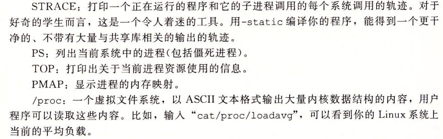

## RIO包健壮的读写
详见rio.h rio.c


## 文件元数据 & 目录

详见UNIX环境高级编程

## 共享文件
内核用三个相关的数据结构表示打开的文件。

- 描述符表。每个进程都有自己独立的描述符表, 表项由文件描述符来索引, 每个打开的描述符表项指向文件表中的一个表项。

- 文件表。打开文件的集合是由一张文件表示的, 所有的进程共享这张表。每个文件表的表项组成包括当前文件的位置、引用计数、以及一个指向vnode表中对应表项的指针。关闭一个描述符会减少相应的文件表表项中的引用计数。内核不会删除这个文件表表项, 直至其引用计数为0。

- v-node表。同文件表一样, 所有进程共享这张v-node表。每个表项包含stat结构中的大多数信息。

示例: 不同的文件表表项引用不同的文件

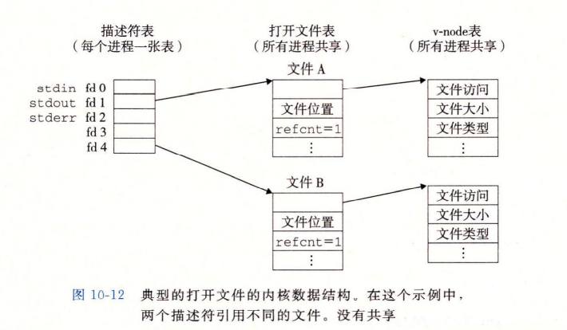

示例: 不同的文件表表项引用相同的文件

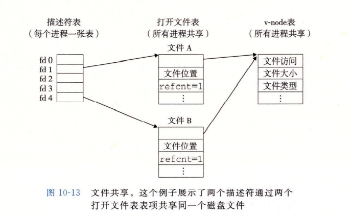

示例: 父子进程的文件表表项

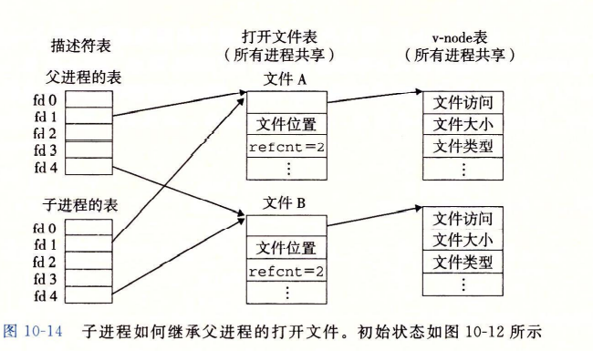
