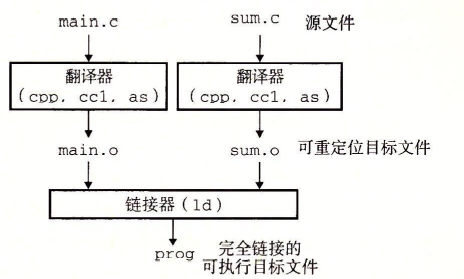
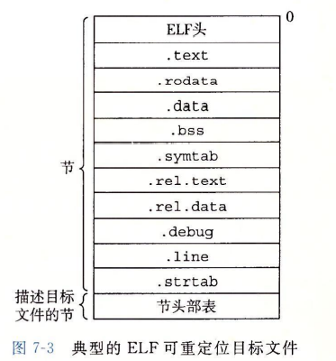
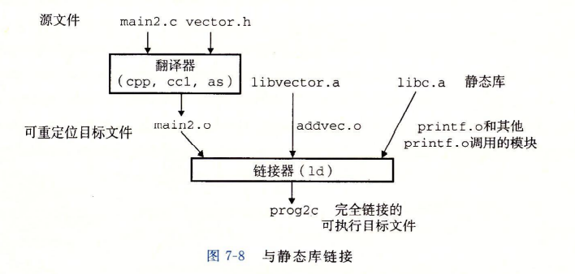
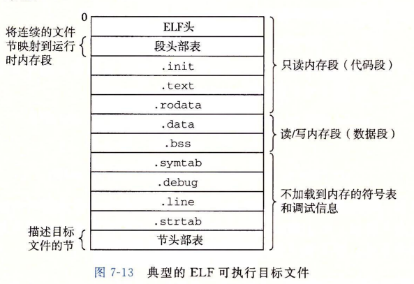
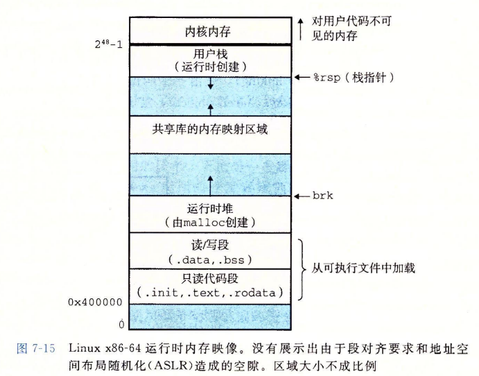
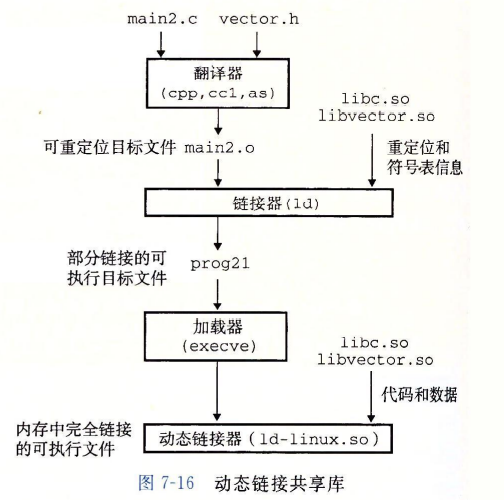
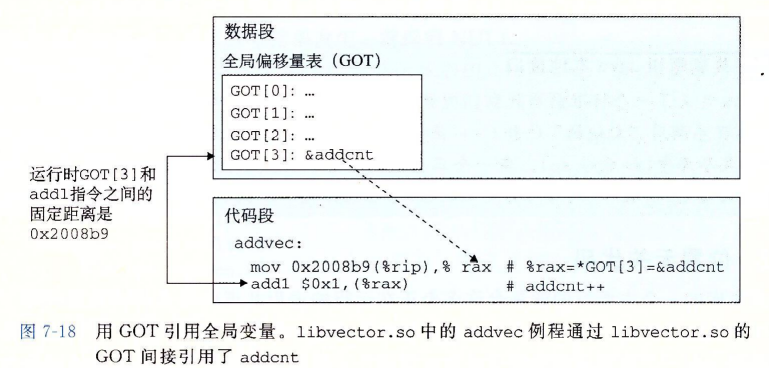
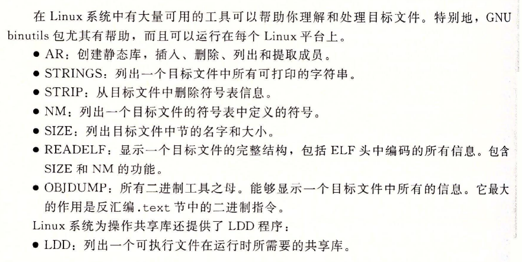

# 链接
**链接**将各种代码和数据片段收集合并为单一可执行文件
## 时间
- 编译时链接:源代码被翻译为机器代码
- 加载时链接:被加载器加载到内存并执行
- 运行时:由应用程序执行

## 编译器驱动程序
**compiler driver**:代表用户在需要时调用语言预处理器, 编译器, 汇编器, 链接器



输入./prog后, shell调用OS中叫做加载器(loader)的函数, 将可执行文件prog中的代码和数据复制到内存, 并将控制转移至程序开头。

## 静态链接
**静态链接器 static linker**以一组可重定位目标文件和命令行参数作为输入, 生成一个完全链接的、可以加载和运行的可执行目标文件作为输出。

### 链接器的两个主要任务
- 符号解析(symbol resolution)。目标文件定义和引用**符号**, 每个符号对应于一个函数、全局变量或者静态变量。目的是将每一个符号引用与一个符号定义关联起来。

- 重定位(relocation)。编译器和汇编器生成从地址0开始的代码和数据节。链接器将每个符号定义与一个内存位置关联起来, 然后修改所有的符号引用, 使他们指向这个位置。链接器使用汇编器产生的重定位条目的详细指令, 不加甄别的执行这些重定位。


## 目标文件
- 可重定位目标文件。包含二进制代码和数据, 在执行时与其他可重定位目标文件合并生成可执行目标文件。

- 可执行目标文件。包含二进制代码和数据, 可直接被复制到内存并执行。

- 共享目标文件。特殊的可重定位目标文件, 在加载或运行时被动态地加载进内存并链接。

## 可重定位目标文件


- ELF头。以一个16字节的序列开始, 描述生成该文件的系统的字的大小和字节顺序。剩下部分包含一些信息：目标文件类型、机器类型(x86-64)、节头部表的文件偏移、节头部表中条目的大小和数量。

- .text 机器代码。
- .rodata 只读数据。
- .data 已初始化的静态和全局变量。
- .bss 未初始化的静态和全局变量。
- .symtab 符号表, 存放程序中定义和引用的函数和全局变量的信息。
- .rel.text 一个.text节中位置的列表, 当链接器进行连接时需要修改这些位置。
- .rel.data 被模块引用或定义的所有全局变量的重定位信息。
- .debug 调试符号表, 用-g选项才会得到。
- .line C源文件行号和.text机器指令的映射, 用-g选项才会得到。
- .strtab 字符串表

## 符号和符号表
每个可重定位目标文件m都有包含m定义和引用的符号的信息。符号类别：

- 全局符号。对应非静态函数和全局变量, 由m定义并能被其他模块引用。
- 外部符号。对应在其他模块定义的非静态函数和全局变量, 被m引用。
- 局部符号。对应于静态函数与静态变量, 只被m定义和引用。

函数内部非静态局部变量由栈管理, 不包含在.symtab中。

```c
int f()
{
    static int x = 0;
    return x;
}

int g()
{
    static int x = 1;
    return x;
}
```

这种情况, 编译器向汇编器输出两个不同名字的局部链接器符号。比如用x.1表示f中的x, 用x.2表示g中的x。

## 符号解析
链接器将每个引用与它输入的可重定位目标文件中的符号表中的一个确定的符号定义关联起来。

当编译器遇到一个不是在当前模块中定义的符号(变量名或者函数)时, 会假设该符号是在其他某个模块中定义的, 生成一个链接器符号表条目, 并把它交给链接器处理。如果链接器在它的任何输入模块中都找不到这个定义, 就输出一条错误信息并终止。

### 链接器如何解析多重定义的全局符号
在可重定位目标文件的符号表中, 函数和已初始化的全局变量是强符号, 未初始化的全局变量是弱符号。

链接器使用下面的规则来处理多重定义的符号名:
- 不允许有多个同名的强符号。
- 如果有一个强符号和多个弱符号同名, 以强符号为准。
- 多个弱符号同名, 随机选取一个。


### 与静态库链接
所有的编译系统都提供一种机制, 将所有相关的目标模块打包成一个单独的文件, 称为静态库。(static library)

相关的函数可以被编译为独立的目标模块(scanf.o printf.o ...), 然后封装成一个单独的静态库文件。在链接时, 编译器只复制被程序引用的目标模块。在Linux系统中, 静态库以**存档 archive**这种特殊的文件格式保存在磁盘中, 是一组连接起来的可重定位目标文件的集合, 有一个头部来描述每个成员目标文件的大小和位置。存档文件名由.a标识。


```c
linux>gcc -c addvec.c multvec.c
linux>ar rcs libvector.a addvec.o multvec.o
```




### 链接器如何使用静态库来解析引用
在符号解析阶段, 编译器从左到右按照它们在编译器驱动程序命令行上出现的顺序扫描可重定位目标文件(.c会自动翻译为.o)。链接器维护三个集合:

- 可重定位目标文件集合E(合并起来形成可执行文件)。
- 未解析的符号集合U(引用了但是尚未找到定义)。
- 已定义的符号集合D。

初始时三者均为空。

1. 对于输入文件f, 如果是目标文件, 则将f添加到E, 并对应的修改U和D。
2. 如果是存档文件, 其某个成员m, 定义了一个符号来解析U中的引用, 就将m加入到E中并修改U和D。对存档文件所有的成员目标文件都进行这个过程直到U和D不再变化。之后任何不包含在E中的成员目标文件都会被丢弃。
3. 当链接器完成扫描后发现U非空, 则输出错误并终止。否则合并E, 输出可执行文件。

错误点:  
在输入命令行中定义一个符号的库出现在引用这个符号的目标文件之前就会出现引用无法被解析的错误。

解决:

- 将库放在命令行结尾, 如果库不是相互独立的, 注意排序。
- 在命令行上重复库。

## 重定位
在这个步骤中, 将合并输入模块, 并为每个符号分配运行时地址。重定位由两步组成:

1. 重定位节和符号定义。链接器将所有相同类型的节合并为同一类型的新的聚合节。然后, 链接器将运行时内存地址赋给新的聚合节, 赋给输入模块定义的每个节, 以及赋给输入模块定义的每个符号。当这一步完成时, 程序中的每条指令和全局变量都有唯一的运行时地址了。

2. 重定位节中的符号引用。链接器修改代码节和数据节中对每个符号的引用, 使得它们指向正确的运行地址。要执行这一步, 链接器依赖于可重定位目标模块中称为重定位条目的数据结构。


### 重定位条目
无论何时汇编器遇到对最终位置未知的目标引用, 它都会生成一个重定位条目, 告诉链接器在将目标文件合并时如何修改它。代码重定位条目放在.rel.text中。已初始化数据的重定位条目放在.rel.data中。

```c
typedef struct{
    long offset;    // 被修改引用的节偏移 
    long type:32,   // 告知链接器如何修改新的引用
         symbol:32; // 标识被修改引用应该指向的符号
    long addend;    // 有符号常数, 一些类型的重定位使用它对被修改引用
                    // 的值做偏移调整 
} ELf64_Rela;
```

ELF定义了32种不同的重定位类型, 我们只关心其中的两种。

- R_X86_64_PC32。重定位一个使用32bit PC相对地址的引用。
- R_X86_64_32。重定位一个使用32bit 绝对地址的引用。

### 重定位符号引用

重定位PC相对引用和重定位绝对引用。


## 可执行目标文件


相比于可重定位目标文件, 它还包含程序的入口点, 也就是当程序运行时要执行的第一条指令的地址。

.init节定义了一个小函数, 叫做_init, 程序的初始化代码会调用它。因为可执行文件是完全链接的, 所以不再需要.rel节。

ELF可执行文件被设计得很容易加载到内存, 可执行文件的连续的片(chunk)被映射到连续的内存段。**程序头部表 program table header**描述了这种映射关系。

对于任何段s, 链接器必须选择一个起始地址vaddr, 使得:  
vaddr mod align = off mod align

vaddr是在内存中的地址, off是目标文件段中第一个节的偏移量, align是程序头部中指定的对齐。这个对齐要求是一种优化, 使得目标文件中的段能够很有效地传送到内存之中。


## 加载可执行目标文件
任何Linux程序都可以通过调用execve函数来调用加载器, 加载器将可执行目标文件中的代码和数据从磁盘复制到内存中, 然后通过跳转到程序的第一条指令或者**入口点**来运行该程序, 这个过程叫做加载。



当加载器运行时, 它创建如上图所示的内存映像。在程序头部表的引导下, 加载器将可执行文件的片(chunk)复制到代码段和数据段。接下来, 加载器跳转到程序的入口点, 也就是_start函数的地址。_start函数调用系统函数__libc_start_main(定义于libc.so中), 它初始化执行环境, 调用用户层的main函数, 处理main函数返回值, 并且在需要的时候把控制返回给内核。

## 动态链接共享库
静态库存在明显的缺陷:

- 如果一个程序员想要使用某库的最新版本, 它们必须将程序与更新的库重新链接。
- 库中被大量使用的目标模块(printf、scanf)在许多程序中被链接, 在运行时造成了内存资源的浪费。

**共享库**是一个目标模块, 在**运行和加载**时可以被加载到任意位置的内存地址, 并和内存中的一个程序链接起来。这个过程称为**动态链接**, 由**动态链接器**执行。共享库也被称为**共享目标**(Linux: .so Windows .dll)。

共享库以两种不同的方式实现共享:

- 在任何给定的文件系统中, 每个库只有一个.so文件, 所有引用该库的可执行目标共享这个.so文件中的代码和数据。
- 在内存中, 一个共享库的.text节的一个副本可以被不同的正在运行的进程共享, 但是有各自的数据区, 并不共享库中定义的数据。



```c
linux>gcc -shared -fpic -o libvector.so addvec.c multvec.c
```

-fpic指示编译器生成与位置无关的代码, -shared指示链接器创建一个共享的目标文件。

```c
linux>gcc -o prog21 main2.c ./libvector.so

// or
linux>export LD_LIBRARY_PATH=.
linux>gcc -o prog21 main2.c -lvector -L.
```


当加载器加载和运行可执行文件prog21时, 加载部分链接的可执行文件prog21, 然后它注意到prog21包含一个.interp节, 这一节包含动态链接器的路径名, 动态链接器本身就是一个共享目标(如ld-linux.so)。加载器不会将控制传递给应用, 而是加载和运行这个动态链接器。之后, 动态链接器通过执行下面的重定位完成链接任务:

- 重定位libc.so的文本和数据到某个内存段。
- 重定位libvector.so的文本和数据到另一个内存段。
- 重定位prog21中所有对由libc.so和libvector.so定义的符号和引用。

## 从应用程序中链接和加载共享库
到目前为止讨论的链接:

- 静态链接, 加载前就将所有可执行目标链接在一起。
- 动态链接共享库, 加载到内存时执行前链接。

应用程序还可以在运行时要求动态链接器加载和链接某个共享库。

Linux提供一组接口, 允许应用程序在运行时加载和链接共享库。
```c
#include <dlfcn.h>
void *dlopen(const char*filename, int flag);
```

加载和链接共享库filename。flag参数必须要么包括RTLD_NOW, 该标志告诉链接器立即解析对外部符号的引用, 要么包括RTLD_LAZY, 该标志指示链接器推迟符号解析直至执行来自库中的代码。

用已带RTLD_GLOBAL选项打开了的库解析filename中的外部符号。如果当前可执行文件是带-rdynamic选项编译的, 则对于符号解析而言, 它的全局符号也可用。

```c
#include <dlfcn.h>
void *dlsym(void *handle, char *symbol);
```
dlsym的输入是一个指向前面已经打开了的共享库的句柄和一个symbol名字, 如果该符号在就返回符号地址, 否则返回NULL。

```c
#include <dlfcn.h>
int dlclose(void *handle);
```

如果没有其他共享库还在使用这个共享库, dlclose函数就卸载掉这个共享库。

```c
#include <dlfcn.h>
const char *dlerror(void);
```
返回一个字符串, 描述的是调用前面三个函数时发生的最近的错误, 如果没有错误发生, 则返回NULL。

```c
linux>gcc -rdynamic -o prog2r dll.c -ldl
```
-ldl意思是链接库libdl.so


## 位置无关代码

共享库: 多个进程如何共享内存中相同的库代码?

可以加载而无需重定位的代码称为**位置无关代码 PIC**。用户使用-fpic选项指示GNU编译系统生成PIC代码。共享库的编译总是使用该代码。

对共享模块定义的外部过程和对全局变量的引用需要一些特殊的技巧:

### PIC数据引用
编译器基于以下的事实来生成对全局变量的PIC引用:  
无论在内存的何处加载目标模块, 其数据段与代码段的距离总是保持不变。



编译器在数据段开始的地方建立全局偏移量表(GOT)。每个被此目标模块引用的全局数据目标都有一个8字节条目, 编译器还为每个条目生成一个重定位记录。在加载时, 动态链接器重定位GOT中的每个条目, 使其包含目标的正确的绝对地址。每个引用全局目标的目标模块都有自己的GOT。

因为addcnt是由libvector.so直接定义的, 编译器可以利用代码段和数据段之间的距离产生对addcnt的PC相对引用, 并增加一个重定位。如果addcnt是由另一个共享模块定义的, 就需要GOT间接访问。

### PIC函数调用
程序调用一个由共享库定义的函数, 但无法预测其运行时地址?

延迟绑定技术。  
把函数地址的解析推迟到它实际被调用的地方, 能避免动态链接器在加载时进行成千上百个不需要的重定位。第一次调用过程的运行时开销很大, 但是其后每次调用都只花费一条指令和一个间接的内存引用。

基础:  
**GOT**和**过程链接表 PLT**  
如果一个目标模块调用定义在共享库中的任何函数, 那么它就有自己的GOT和PLT。GOT是数据段的一部分, PLT是代码段的一部分。


## 库打桩机制 (library interpositioning)
允许你截获对共享库函数的调用, 取而代之执行自己的代码。使用打桩机制, 可以追踪对某个特殊库函数的调用次数, 验证和追踪其输入输出值。甚至将其替换为完全不同的实现。

目标函数与包装函数的原型要相同。打桩可以发生在编译时、链接时或者当程序被加载和执行的运行时。

### 编译时打桩
```c
linux>gcc -DCOMPILETIME -c mymalloc.c
linux>gcc -I. -o intc int.c mymalloc.o
```


### 链接时打桩
Linux静态编译器支持用--wrap f标志进行链接时打桩, 它告诉链接器把对符号f的引用解析成__wrap_f, 还要把对符号__real_f的引用解析为f。

```c
linux>gcc -DLINKTIME -c _mymalloc.c
linux>gcc -c int.c

linux>gcc -Wl,--wrap,malloc -Wl,--wrap,free -o intl int.o _malloc.o

```

### 运行时打桩


## 处理目标文件的工具



