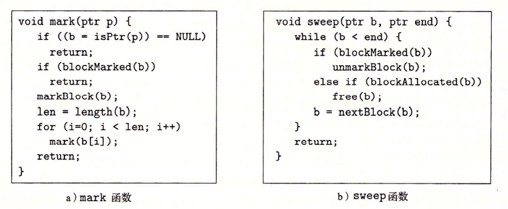

# 虚拟内存
1. 它将主存看作是一个存储在磁盘地址空间的高速缓存, 根据需要传送数据。
2. 为每个进程提供一致的地址空间, 从而简化了内存管理。
3. 保护了每个进程的地址空间不被其他进程破坏。

## 物理寻址与虚拟寻址

早期的PC, 以及数字信号处理器、嵌入式微控制器以及Cray超级计算机这样的系统仍然继续使用物理寻址。

虚拟寻址, 地址翻译需要CPU硬件和操作系统配合。CPU芯片上叫做内存管理单元MMU的专用硬件, 利用存放在主存中的查询表来动态翻译虚拟地址。

## 地址空间。
地址空间是一个非负整数地址的有序集合。如果地址空间中的整数是连续的, 我们就说它是一个线性地址空间。在一个带虚拟内存的系统中, CPU从一个有$N=2^n$个地址的地址空间中生成虚拟地址, 这个地址空间称为虚拟地址空间。

## 虚拟内存作为缓存的工具

磁盘上的数据被分割成块, 这些块作为磁盘和主存之间的传输单元。VM系统通过将虚拟内存分割为称为虚拟页的大小的固定的块来处理这个问题, 类似地, 物理内存被分割为物理页。

任意时刻, 虚拟页面的集合分为三个不相交的子集:

- 未分配的: VM系统还未分配的(或者创建的页)。未分配的块没有任何数据和它们相关联, 因此不占用任何磁盘空间。
- 缓存的: 目前已缓存在物理内存中的页。
- 未缓存的: 未缓存在物理内存中的已分配页。

### DRAM缓存的组织结构
- DRAM缓存的组织结构完全是由巨大的不命中开销驱动的。
- 大的不命中处罚和访问第一个字节的开销使得虚拟页往往很大, 通常是4KB~2MB。由于大的不命中处罚, DRAM缓存是全相联的。
- 由于对磁盘的访问时间很长, DRAM总是采用写回而不是直写。

### 页表
判定虚拟页是否缓存在DRAM、缓存在哪个物理页、不命中存放在磁盘哪个位置、替换策略的选取。

这些功能由操作系统软件、MMU中的 地址翻译硬件和一个存放在物理内存中叫做页表的结构来提供。

操作系统负责维护页表的内容, 以及在磁盘和DRAM之间来回传送页。页表就是一个**页表条目 PTE**的数组。

每个PTE是由一个有效位和一个n位地址字段组成的。有效位表明该虚拟页是否被缓存在DRAM中。

### 页命中

### 缺页

VP4作为牺牲页被换出, 之前如果VP4如果有修改执行写回磁盘。

在虚拟内存的习惯说法中, 块被称为页, 内存与磁盘之间传送页的活动称为交换或者页面调度。只有当不命中情况发生时才换入页面的策略称为按需页面调度。

### 分配页面

### 局部性优势

局部性保证了在任意时刻, 程序趋向于在一个较小的**活动页面**集合上工作, 这个集合叫做**工作集**或者**常驻集合**。只要程序具有良好的时间局部性, 虚拟内存系统就能工作的很好。如果工作集的大小超出物理内存的大小, 那么程序就会产生抖动的状态。

## 虚拟内存作为内存管理的工具
实际上, 操作系统为每个进程都提供了一个独立的页表, 因而也就有独立的虚拟地址空间。多个虚拟页面可以映射到同一共享物理页面上。

VM简化了链接和加载、代码和数据共享, 以及应用程序的内存分配。

- *简化链接*。独立的地址空间允许每个进程的内存映像采用相同的基本格式, 而不管数据和代码存放在物理内存的何处。
- *简化加载*。加载器从不从磁盘到内存实际复制任何数据。当每个页初次被引用时, 虚拟内存才会按照需要自动调入页。
- *简化共享*。操作系统创建页表将相应虚拟页映射到不连续的物理页以及将不同进程适当的虚拟页映射到相同的物理页。
- *简化内存分配*。当一个运行在用户程序的进程要求额外堆空间时, 操作系统分配k个连续的虚拟内存页面, 并将它们映射到物理内存中任意位置的k个任意的物理页面。

## 虚拟内存作为内存保护的工具

因为每次CPU生成一个地址时, 地址翻译硬件都会读一个PTE, 所以通过在PTE上添加一些额外的许可位来控制对一个虚拟页面内容的访问十分简单。

SUP代表一个进程是否必须运行在内核模式下才能访问该页。运行在内核模式中的进程可以访问任何页面, 但是运行在用户模式中的进程只允许访问SUP为0的页面。

## 地址翻译

CPU中的一个控制寄存器, **页表机制寄存器 PTBR**指向当前页表。n位的虚拟地址包含两个部分, p位的虚拟页面偏移和n-p位的虚拟页号。

### 结合高速缓存和虚拟内存

### 利用TLB加速地址翻译
TLB是一个小的、虚拟寻址的缓存, 其中每一行都保存着一个由单一PTE组成的块, 通常具有高度的相联度。

### 多级页表
单个页表所占用空间过大。

一级页表中的每个PTE负责映射虚拟地址空间中一个4MB的片(chunk), 这里的每一个片都是由1024个连续的页组成的。如果片i中的每个页面都未被分配, 那么一级PTEi就为空。如果在片i中至少有一个页被分配了, 那么一级PTEi就指向一个二级页表的基址。

二级页表中的每个PTE都负责映射一个4KB的虚拟内存页面。这种做法大大节约了内存:

1. 如果一个一级PTE是空的, 那么相应的二级页表根本就不存在。
2. 只有一级页表才总是在主存中, 虚拟内存系统可以在需要时创建、页面调入或调出二级页表。只有最常使用的二级页表才会缓存在主存中。

## Linux虚拟内存系统

内核虚拟内存包含内核中的代码和数据结构。内核虚拟内存的某些区域被映射到所有进程共享的物理页面。

每个进程共享内核的代码(如系统调用)和数据结构。Linux也将一部分连续的虚拟页面映射到相应的一组物理页面。这为内核提供了一种便利的方法来访问物理内存中某些特定的位置, 例如需要访问页表或者在一些设备上执行内存映射的I/O操作。

内核虚拟内存的其他部分包含了每个进程不同的数据。

该图记录了一个进程中虚拟内存区域的内核数据结构。内核为每个进程维护一个单独的任务结构task_struct。任务结构中的元素包含或者指向内核运行该进程所需要的所有信息, 例如PID、指向用户栈的指针、可执行目标文件的名字以及程序计数器。

任务结构中的一个条目指向mm_struct, 描述了虚拟内存的当前状态。pgd指向第一级页表的基址, mmap指向一个vm_area_structs的链表。每个vm_area_struct都描述了当前进程虚拟地址空间的一个区域(段)。

缺页异常处理:  
假设MMU试图在翻译某个虚拟地址A时触发了一个缺页。这个异常导致控制转向到内核的缺页处理程序

1. 虚拟地址A是否合法。缺页处理程序会搜索vm_area_structs链表比对判断, 如果不合法则触发segmentation fault从而终止该进程。
2. 试图进行的内存访问行为是否合法。即进程是否有读写此页的权限, 如果是不合法的, 缺页处理程序会触发一个保护异常从而终止该进程。
3. 正常缺页则进行换入换出行为。

注:由于内存对齐等原因, 进程的虚拟地址空间存在间隙, 不一定是连续的。

## 内存映射
Linux通过将一个虚拟内存区域与一个磁盘上的对象关联起来以初始化这个虚拟内存区域的内容, 这个过程称为**内存映射 memory mapping**。虚拟内存区域可以映射到两种类型对象中的一种:

1. Linux文件系统中的普通文件。
2. 匿名文件。由内核创建, 包含的全是二进制0。

无论哪种情况, 一旦一个虚拟页面被初始化, 它就在一个由内核维护的专门的**交换文件 swap file**之间换来换去。交换文件也叫做交换空间或者交换区域, 在任何时候, 交换空间都限制着当前运行着的进程能够分配的虚拟页面的总数。

## 动态内存分配

虽然可以使用mmap和munmap来创建和删除虚拟内存的区域, 但C程序员认为用动态内存分配器更方便也有更好的移植性。

动态内存分配器维护着一个进程的虚拟内存区域称为堆(heap)。分配器将堆视为一组不同大小的块(block)的集合来维护。每个块就是一个连续的虚拟内存片(chunk), 要么是已分配的, 要么是空闲的。

分配器有两种风格:

- 显示分配器, 要求应用显式地释放任何已经分配的块。(malloc free)
- 隐式分配器, 也叫做垃圾收集器。(Java)

### 分配器的要求和目标

1. 处理任意请求序列。每个释放请求对应于一个已分配块, 分配器不可以假设分配和释放请求的顺序。
2. 立即响应请求。
3. 只使用堆。
4. 对齐块。
5. 不修改已分配的块。

分配器设计的一个有趣的挑战就是在最大化吞吐率和最大化内存利用率之间达到平衡。

### 碎片
当有未使用的内存但是不能满足分配需求时就会产生碎片。

1. 内部碎片是在一个已分配块比有效载荷大时发生的, 比如分配器可能增加块大小以满足对齐条件。
2. 外部碎片是指空闲内存总计大小可以满足一个分配请求但是没有一个单个的空闲块足够大以满足该分配请求。

### 隐式空闲链表

在这种情况中, 一个块是由一个字的**头部**、有效载荷以及可能的一些额外的**填充**组成的。如果强加双字(8bytes)对齐的约束条件, 那么块大小总是8的倍数, 即最低3bit总为0。

有效载荷后面是填充部分, 需要填充的原因有很多。比如填充可能是分配器策略的一部分, 用来对付外部碎片或者用来满足对齐要求。

### 放置已分配的块
策略:

1. 首次适配。
2. 下一次适配。
3. 最佳适配。

### 分割空闲块

### 获取额外的堆内存

sbrk函数

### 合并空闲块

为了解决加碎片问题, 任何实际的分配器都必须合并相邻的空闲块, 这个过程称为合并。

何时合并?

- 立即合并
- 推迟合并

### 带边界标记的合并

如何合并前面的块?

在每个块的结尾添加一个脚部, 它就是头部的一个副本。这个脚部总是在距当前块开始位置一个字的距离。

头部和脚步会产生显著的内存开销, 有一种方法可以使得在已分配块中不再需要脚部。即把前面块的已分配/空闲位存放在当前块中多出来的低位中, 那么已分配的块不再需要脚部。不过空闲块仍然需要脚部。

### 显示空闲链表

在隐式空闲链表中, 块分配与堆块的总数呈线性关系, 即我们每次都要从头顺序扫描寻找可用块并且在最坏情况下这种时间复杂度是堆块的总数。所以对于通用分配器, 隐式空闲链表是不合适的。

更好的方式是将空闲块组织为某种形式的显示数据结构。

双向空闲链表使得首次适配的分配时间复杂度从块总数的线性时间降低到空闲块数量的线性时间。

而对于释放一个块而言可以是线性的也可以是常数。一种方法是用后进先出(LIFO)的顺序维护链表, 将新释放的块放在链表的开始处。

另一种方式是按照地址顺序维护链表, 其中链表每个块的地址都小于它的后继地址。这种情况下释放一个块需要线性时间的搜索来定位合适的前驱。

一般而言显示链表的缺点就在于空闲块必须足够大以容纳空闲指针以及头部和可能的脚部, 这就导致更大的最小块大小, 潜在地提高了内部碎片的程度。

### 分离的空闲链表

**分离存储**, 维护多个空闲链表, 每个链表中的块有大致相等的大小。

1. 根据2的幂来划分大小。  
${\{1\}},{\{2\}},{\{3,4\}},{\{5,...,8\}},...,$

2. 较小的块分配到自己的大小类里而大块按照2的幂分类。

#### **简单分离存储**

操作:

1. 链表中的每个块大小相同, 为大小类中的最大值。
2. 空闲块不会分割以满足分配需求, 也不会合并。
3. 无满足链表就申请一个新的页并分割来分配。
4. 释放一个块直接插入到头部即可。

优点:

1. 分配和释放块只需消耗常数时间。
2. 不需要头部和脚部。
3. 只需要后继指针而不需要前驱指针。
4. 最小块大小就是一个字的后继指针大小。

缺点: 更多的内部和外部碎片。(不分割、不合并)

#### **分离适配**

操作:

1. 每个链表包含潜在大小的块。
2. 有满足需求的块时, (可选地)分割它, 将剩余部分插入到合适的空闲链表中。
3. 没有合适的块就申请额外的堆内存, 分割后将剩余部分插入到合适的空闲链表。
4. 释放一个块执行合并, 并将结果放至相应空闲链表。

#### **伙伴系统**
1. 分离适配的一种特例。
2. 每个链表的大小类都是2的幂。
3. 请求块大小向上舍入到最接近的2次幂。
4. 初始只有一个$2^k$块。
5. 对于请求块$2^k$, 找到第一个可用的块$2^j$, 其中$k \leq j \leq m$, 若不满足$j=k$则递归的二分, 每个剩下的半块放入相应空闲链表。
6. 释放$2^k$块, 继续合并空闲的伙伴。

优点: 快速搜索和快速合并

缺点: 要求块大小都为2的幂可能导致内部碎片。

## 垃圾收集

**垃圾收集器**是一种动态内存分配器, 自动释放程序不再需要的已分配块。自动回收堆存储的过程叫做**垃圾收集**

### 垃圾收集数据结构

- 每个堆节点对应于堆中的一个已分配块。
- 根节点对应于不在堆中的位置但是包含指向堆节点的指针。
- 有向边p->q意味着块p中的某个位置指向块q中的某个位置。
- 不可达节点对应于垃圾, 是不能被再次使用的。
- 收集器可以按需提供它们的服务或者作为一个和应用并行的独立线程。

### Mark & Sweep垃圾收集器

Mark & Sweep垃圾收集器由标记阶段和清除阶段组成, 标记阶段标记出根节点所有可达的和已分配的后继, 后面的清除阶段释放每个未被标记的已分配块。

### C程序保守的Mark & Sweep

1. C语言不会用任何类型信息来标记内存位置, 因此我们不知道isPtr的输入参数p是不是一个指针。
2. 即便知道p是一个指针, 也没有明显方式来判断它是否指向一个已分配块的有效载荷中的某个位置。

对第二个问题的解决是采用一个平衡二叉树对每个已分配块信息进行记录。

C程序的Mark & Sweep收集器必须是保守的, 根本原因是它不会用类型信息来标记内存位置。假设某个可达的已分配块在它的有效载荷中包含一个int, 它的值恰好与其他某个已分配块b的地址相同, 对收集器而言, 无法判断出这是个int还是一个ptr, 因此只能保守地将其标记为可达, 尽管它可能是不可达的。

