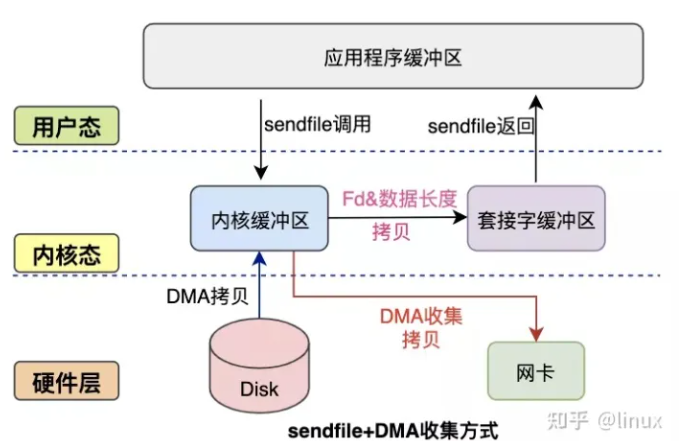

## 用户缓冲区与内核缓冲区
用户进程缓存区
一些程序在读取文件时，会先申请一块内存数组，称为buffer，然后每次调用read，读取设定字节长度的数据，写入buffer。（用较小的次数填满buffer）。之后的程序都是从buffer中获取数据，当buffer使用完后，在进行下一次调用，填充buffer。所以说：用户缓冲区的目的是为了减少系统调用次数(调用read不需要再切换到内核态，直接在用户态读取缓冲区即可)，从而降低操作系统在用户态与核心态切换所耗费的时间。除了在进程中设计缓冲区，内核也有自己的缓冲区。

内核缓存区
当一个用户进程要从磁盘读取数据时，内核一般不直接读磁盘，而是将内核缓冲区中的数据复制到进程缓冲区中。(减少磁盘I/O)但若是内核缓冲区中没有数据，内核会把对数据块的请求，加入到请求队列，然后把进程挂起，为其它进程提供服务。

## 零拷贝技术

两次状态切换:

- 用户态->内核态
- 内核态->用户态

两次数据拷贝

- CPU: 内核缓冲区->用户缓冲区或相反(写方向)
- DMA: 磁盘->内核缓冲区或相反(写方向)

之所以不直接拷贝到用户缓冲区是为了安全性

### mmap
mmap是Linux提供的一种内存映射文件的机制，它实现了将内核中读缓冲区地址与用户空间缓冲区地址进行映射，从而实现内核缓冲区与用户缓冲区的共享。这样就减少了一次用户态和内核态的CPU拷贝，但是在内核空间内仍然有一次CPU拷贝。mmap对大文件传输有一定优势，但是小文件可能出现碎片，并且在多个进程同时操作文件时可能产生引发coredump的signal。

### sendfile
mmap+write方式有一定改进，但是由系统调用引起的状态切换并没有减少。sendfile系统调用是在 Linux 内核2.1版本中被引入，它建立了两个文件之间的传输通道。sendfile方式只使用一个函数就可以完成之前的read+write 和 mmap+write的功能，这样就少了2次状态切换，由于数据不经过用户缓冲区，因此该数据无法被修改。

从图中可以看到，应用程序只需要调用sendfile函数即可完成，只有2次状态切换、1次CPU拷贝、2次DMA拷贝。

### sendfile+DMA收集

Linux 2.4 内核对 sendfile 系统调用进行优化，但是需要硬件DMA控制器的配合。升级后的sendfile将内核空间缓冲区中对应的数据描述信息（文件描述符、地址偏移量等信息）记录到socket缓冲区中。DMA控制器根据socket缓冲区中的地址和偏移量将数据从内核缓冲区拷贝到网卡中，从而省去了内核空间中仅剩1次CPU拷贝。

### splice

splice系统调用是Linux 在 2.6 版本引入的，其不需要硬件支持，并且不再限定于socket上，实现两个普通文件之间的数据零拷贝。splice系统调用可以在内核缓冲区和socket缓冲区之间建立管道来传输数据，避免了两者之间的 CPU 拷贝操作。

